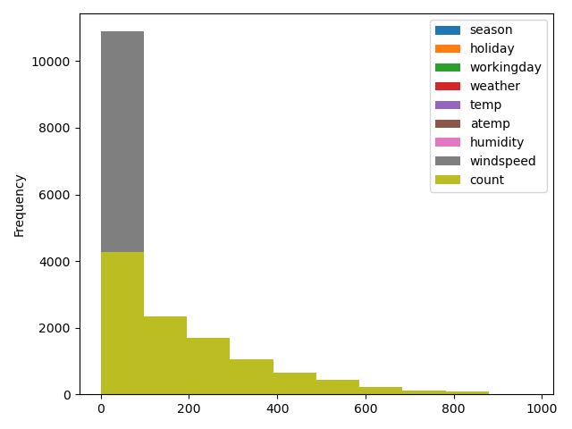
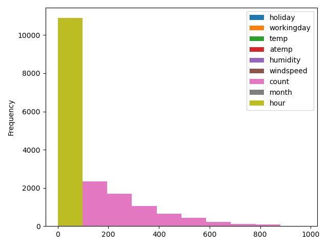
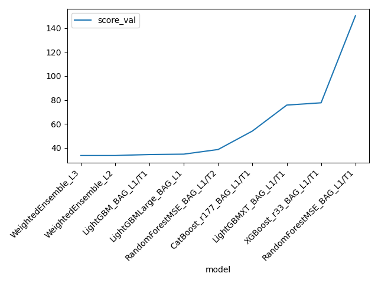
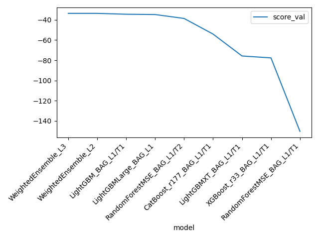
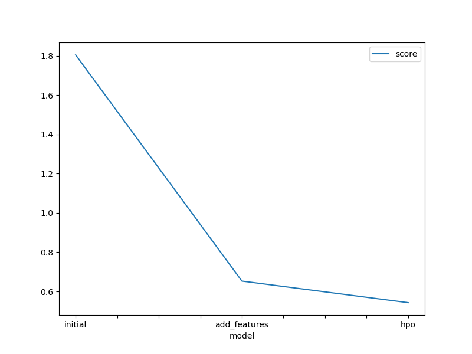
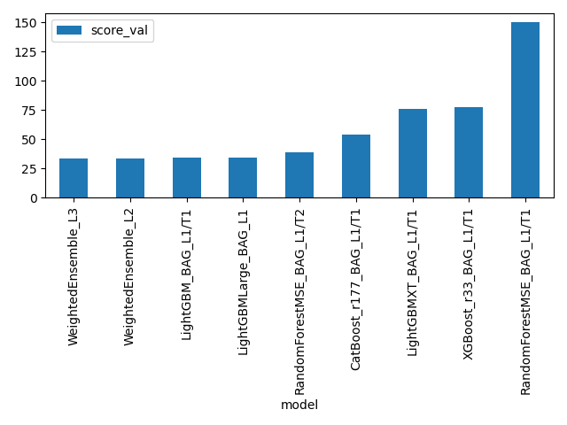

# Report: Predict Bike Sharing Demand with AutoGluon Solution
##### Maryanne Muthoni Nduhiu
## Initial Training
### What did you realize when you tried to submit your predictions? What changes were needed to the output of the predictor to submit your results?
<ul>
    <li>I needed to match the format in the sampleSubmission.csv 
    <li>get rid of any values less than 0 from the series of predictions then i could upload the csv to kaggle for a scoring.
</ul>

### What was the top ranked model that performed?
<ul>
    <li>WeightedEnsemble_L3 with a  root_mean_squared_error of  -53.161871  from the grap below you can see the values inverted because i multiplied the score value by -1 to make it more readable so the model with the lowest value is the one that perfomed the best the the one having the most having performes the worst</li>
</ul>

## Exploratory data analysis and feature creation
### What did the exploratory analysis find and how did you add additional features?
<ul>
   <li>Datetime needed feature extraction so that we could see the data more clearly to do this we parse datetime using pandas to_datetime function on the train and test dataset.</li>
   <li>We can now get more infromation like the day, year, ,month and hour i saw no need to add the year as a new featureas it did not add any more insights.</li>
   <li>I changed the season and weather columns in the train and test dataset to be of type category.</li>
   <li>After this we can now see how the data is spread according to count and the hour from datetime as seen in the below histograms</li> 
</ul>

    

### How much better did your model perform after adding additional features and why do you think that is?
It perfromed way better i think its becase the additional of features added more information about the input variables/columns and the target column

## Hyper parameter tuning
### How much better did your model perform after trying different hyper parameters?
It did even better, I started by training the models with hyperparameter optimization one by one so that i could see how they perfromed indvividually once i was satisfied with the results i then combine the four models, the GBM model used the 'extra_trees' parameter set to True, with the number of boosting rounds set to a space between 100 and 200. The RF model used the number of estimators set to a space between 100 and 200, with a maximum depth set to a space between 1 and 50. The CAT model used the depth set to a space between 6 and 10, with a learning rate of 1e-1. The XGB model used the learning rate set to a space between 1e-2 and 1e-1. The GBMLarge model, which is a larger version of the GBM model, did not improve the RMSE score further so i will probably get ridof it. It was quite interesting going through their documentations to figure out what parameters were there to tune to my benefit and for my regression problem. From the table below we can see the parameters i decided to go with. Combining the models togther ensured that the score was better and the root mean squared was squashed as much as possible.

### If you were given more time with this dataset, where do you think you would spend more time?
I would spend more time in the feature engineering because there are more features that can be extracted from our columns for example the hour column which we parsed from the date time would allow us to set different times of the days when bikes are on demand and hence provide an even better insight, the hyperparameter optimization would be another section i would concentrate on as there as so many options to experiment with and get better results in the hpo. Lastly i would add more time_limit for the process to get better results.

### Create a table with the models you ran, the hyperparameters modified, and the kaggle score.
|model|hpo1|hpo2|hpo3|hpo4|score|
|--|--|--|--|--|--|
|initial|default|default|default|default|1.80472|
|add_features|default|default|default|default|0.65303|
|hpo|"GBM:{'extra_trees': True, 'num_boost_round':space.Int(100,200), 'ag_args': {'name_suffix': 'XT'}, 'boosting':'rf'}, {}, 'GBMLarge'"| "RF: {'n_estimators': space.Int(100, 200), 'max_depth': space.Int(1, 50), 'random_state': space.Int(0, 100), 'ag_args': {'name_suffix': 'MSE', 'problem_types': 'regression'}}"| "CAT: {'ag_args': {'name_suffix': '_r177', 'priority': -1}, 'depth': space.Int(6,10), 'learning_rate': 1e-1}" | "XGB:{'learning_rate': space.Real(1e-2, 1e-1), 'ag_args': {'name_suffix': '_r33', 'priority': -8}}"] | 0.54303|

## Create a line plot showing the top model score for the three (or more) training runs during the project.

 

## Create a line plot showing the top kaggle score for the three (or more) prediction submissions during the project.

## Summary
<ul>
<li>This project focuses on using AWS open-source AutoML library, AutoGluon to predict the bike sharing demand using the Kaggle Bike Sharing demand dataset. The objective was to use AutoGluon's 'Tabular Prediction' to achieve accurate AutoML-based baseline models without dealing with cumbersome issues like data cleaning, feature engineering, hyperparameter optimization, model selection. Which we however still do o see how it works plus experiment with and i found that really cool albei challenging on its own. Using the Autogluon documentation is a skill i have acquired because i really learned how to understand the way doumentations work and that to me is an added plus.</li>

<li>The approach taken in this project involved downloading and analyzing the dataset from kaggle, training a model using AutoGluon's Tabular Prediction on the given dataset, and submitting predictions to Kaggle for ranking.</li>

<li>Feature engineering was incorporated to improve the performance of the model using the default automated settings of AutoGluon's Tabular prediction in the date time, weather and seasons columns. Multiple revised iterations of the model were carried out to further improve performance, with some hyperparameters being fine-tuned in order to improve the model's performance which we can see in he table above and the image below.</li>
    

    
<li>This project demonstrated the use of AutoGluon's Tabular Prediction for predicting bike sharing demand and by using feature engineering and hyperparameter tuning, the model's performance was significantly improved. This has reinforced the importance of feature engineering and hyperparameter tuning in improving model performance.  Overall, this project provided valuable experience in working with real-world datasets and applying machine learning techniques to solve a practical problem.</li>
    
<li>I used the autogluons documentation and the internet to help me out where i was stuck and could not understand. My session lead Lamia really helped too where i was stuck.</li>
    
</ul>